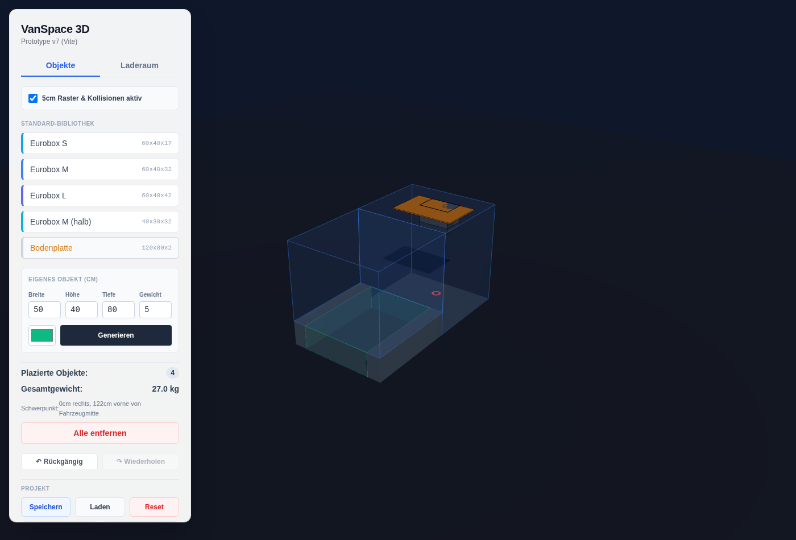
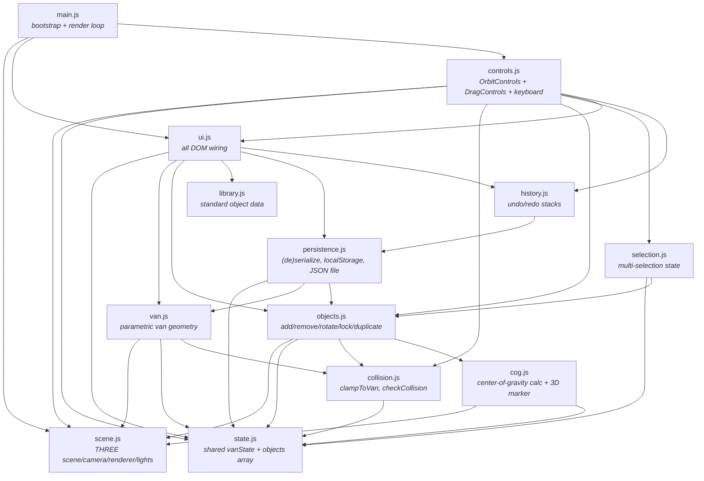

# VanSpace 3D — Prototype

A browser-based 3D tool for planning how cargo fits into a van. Configure the vehicle's cargo area (length, height, width, wheel-arch narrowing), drop objects into it from a library or define your own, and drag them around with collision detection and face/grid snapping.

Vanilla JavaScript + [Three.js](https://threejs.org/) + [Vite](https://vitejs.dev/) — no UI framework, no state-management library. See [`../PLAN.md`](../PLAN.md) for the target production architecture this prototype is de-risking, and [`../README.md`](../README.md) for how the two relate.



## Features

**Vehicle configuration** (Laderaum tab) — overall length/height/width, a front section at full width, and a rear section narrowed by wheel arches (configurable width and height), all live-updating sliders.

**Object placement**
- A data-driven standard library of Eurobehälter (Euro stacking container) sizes plus a floor board, each with an illustrative default weight:

  | Object | Size (W×D×H, cm) | Weight |
  |---|---|---|
  | Eurobox S | 60×40×17 | 3 kg |
  | Eurobox M | 60×40×32 | 8 kg |
  | Eurobox L | 60×40×42 | 12 kg |
  | Eurobox M (halb) | 40×30×32 | 5 kg |
  | Bodenplatte | 120×80×2 | 4 kg |
- A custom object generator (width/height/depth/weight/color).
- Drag & drop with optional snapping and per-axis collision rollback (an object slides along a free axis even when another axis is blocked, instead of getting stuck). Snapping prefers catching a neighboring object's adjacent face — stacking flush on top of it, or side-by-side — within a 4cm tolerance, and falls back to the plain 5cm grid when no neighbor is close enough.
- 90° rotation, duplication, deletion, and locking (see keyboard shortcuts).
- **Multi-select**: shift+click accumulates objects into a selection, or shift+drag over empty space marquee-selects everything inside the rectangle; selected objects get a blue outline (in the 3D view and the object list). With more than one object selected, dragging any of them moves the whole group together (rigidly — locked members stay selected but aren't moved), and `R`/Delete rotate/delete the whole group. A plain click (or `Esc`) clears the selection.

**Weight & balance** — every object carries a weight; the total and a weighted plan-view center of gravity (with a floor marker in the 3D scene) update live as you place, move, or remove objects.

**Undo/redo** — a full history stack over van configuration *and* object placement, one entry per user gesture (not per mouse-move or per-repeat keystroke).

**Persistence** — autosaves to `localStorage` and reloads on next visit; manual Save/Load/Reset; export/import as a `.json` file for sharing a layout outside the browser.

**Lock flag** — protect an object from being moved, rotated, or deleted (individually, or by "Alle entfernen" / clear-all); shown with a red outline. Undo/redo and Load still fully replace the scene, including locked objects, so they stay perfectly reproducible.

**Responsive layout** — on viewports below the `md` breakpoint (768px), the side panel becomes a full-width bottom sheet that starts collapsed so the 3D view stays visible, and expands/collapses via the ▲/▼ button next to the header. Touch-drag for object placement works via the same pointer-event-based `DragControls` used for mouse (it also disables touch scrolling on the canvas so a drag doesn't fight the page).

## Keyboard shortcuts

Object shortcuts act on whichever object the mouse is currently hovering — except `R` and `Delete`/`Backspace`, which act on the whole multi-selection instead whenever more than one object is selected (see Multi-select above).

| Shortcut | Action |
|---|---|
| Drag with mouse | Move the hovered object, or the whole selection if it's part of a multi-selection |
| Shift+click | Add/remove the clicked object from the selection |
| Shift+drag (empty space) | Marquee-select every object inside the dragged rectangle |
| `R` | Rotate 90° (whole selection if >1 selected) |
| `↑` / `↓` | Move up/down 5cm |
| `L` | Toggle lock |
| `Delete` / `Backspace` | Delete (whole selection if >1 selected) |
| `Ctrl`/`Cmd`+`D` | Duplicate (hover moves to the copy) |
| `Esc` | Clear the current selection |
| `Ctrl`/`Cmd`+`Z` | Undo |
| `Ctrl`/`Cmd`+`Y` or `Ctrl`/`Cmd`+`Shift`+`Z` | Redo |

All shortcuts are suppressed while a form field (e.g. the custom-object inputs) has focus, so typing digits or pressing Backspace there never touches the 3D scene.

## Getting started

Requires Node.js ≥ 18.

```bash
npm install
npm run dev       # start the dev server
npm run build     # production build to dist/
npm run preview   # preview the production build
npm test          # run the test suite once
npm run test:watch
```

> If `npm run dev` fails with a syntax error on `await import(...)`, your shell is picking up an old Node binary — run `node -v` and make sure it resolves to ≥ 18 (e.g. via `nvm use`) before retrying.

## Project structure

Plain ES modules, no bundler-specific magic beyond what Vite provides out of the box. Each module has a single responsibility; the dependency graph is intentionally a DAG (no cycles):



- **`state.js`** — the only shared mutable state (`vanState`, the `objects` array). Everything else either reads it or is handed a reference.
- **`scene.js`** — THREE.js scene/camera/renderer/lighting setup. Pure side effects, no app logic.
- **`collision.js`** — pure functions: clamp a position into the current van bounds, check AABB overlap against all placed objects, and `findFaceSnap` for face/stack snapping.
- **`van.js`** — builds/rebuilds the van's 3D geometry from `vanState` and re-clamps every placed object whenever it changes.
- **`cog.js`** — weighted center-of-gravity math plus the floor marker and stat readouts.
- **`objects.js`** — the object lifecycle: create, duplicate, remove, rotate, lock/unlock, clear (all vs. unlocked-only); also owns the locked/selected edge-color precedence (`refreshObjectAppearance`).
- **`selection.js`** — multi-selection state (`obj.userData.selected`, the same pattern as `locked`) and its mutators; no DOM, no THREE-specific logic.
- **`library.js`** — static data for the standard object buttons.
- **`persistence.js`** — `serializeState()`/`applyState()` are the single source of truth for the save format, reused by `localStorage` save/load, JSON file export/import, *and* the undo/redo history.
- **`history.js`** — undo/redo stacks built on `persistence.js`'s (de)serialization.
- **`controls.js`** — `OrbitControls` (camera) + `DragControls` (objects) wiring, keyboard shortcuts, and the marquee/shift-click pointer handling for multi-select.
- **`ui.js`** — every DOM event listener and DOM read/write; the only module that touches `document` outside of small `getElementById` guards elsewhere.
- **`main.js`** — bootstraps the app and runs the render loop.

`legacy/vanspace3d_prototype_optimized.html` is the original single-file version this was refactored from — kept for reference, no longer maintained.

## Testing

[Vitest](https://vitest.dev/) + [jsdom](https://github.com/jsdom/jsdom), one test file per source module, 200+ tests. Since jsdom has no WebGL, tests mock `scene.js`'s `WebGLRenderer` creation at the leaf and otherwise use real Three.js objects (`BoxGeometry`, `Mesh`, `Vector3`, …) — geometry, collision, and undo/redo math are exercised for real, not just their call signatures.

```bash
npm test
```

Interaction-heavy changes (drag/collision/camera behavior) are additionally verified with a headless-Chromium (Playwright) smoke pass during development — not part of the committed test suite, since it needs a running dev server and a browser binary.

## Known limitations

- Persistence is local to one browser (`localStorage` + manual JSON export) — no accounts, no server, no cross-device sync.
- No vehicle editor UI yet — van shape is edited via the sliders in the Laderaum tab, not a saved/reusable vehicle profile.
- Single vehicle, single project at a time.

See [`../PLAN.md`](../PLAN.md) for what a full implementation would add on top of this.
